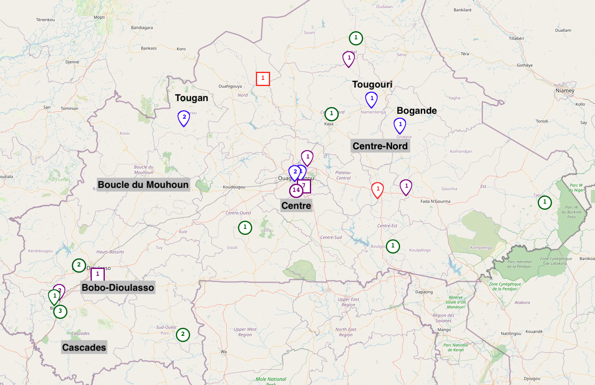
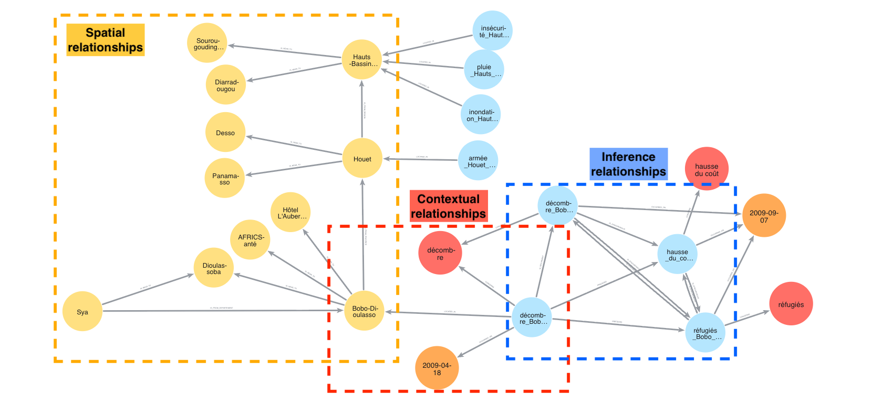
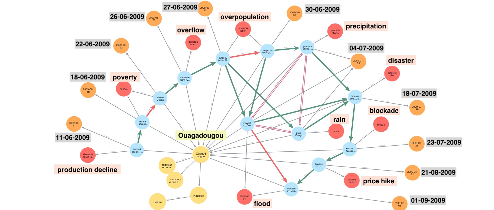

# STKGFS: Spatio-Temporal Knowledge Graph from Unstructured Texts for Food Security Monitoring

A framework for constructing spatio-temporal knowledge graphs from French news articles to monitor food security in Burkina Faso.

> **Paper**: *Spatio-Temporal Knowledge Graph from Unstructured Texts: A Multi-Scale Approach for Food Security Monitoring*
> **Authors**: Charles Abdoulaye Ngom, Landy Rajaonarivo, Sarah Valentin, Maguelonne Teisseire
> Accepted in **AGILE: GIScience Series, 2026**
>
> **Model DOI**: [10.57967/hf/7766](https://doi.org/10.57967/hf/7766) | **Dataset DOI**: [10.57967/hf/7767](https://doi.org/10.57967/hf/7767)

---

## Table of Contents

- [Overview](#overview)
- [Installation](#installation)
- [Project Structure](#project-structure)
- [Data Description](#data-description)
- [Reproducibility Guide](#reproducibility-guide)
- [Neo4j Queries and Visualizations](#neo4j-queries-and-visualizations)
- [Results and Interpretation](#results-and-interpretation)
- [Pre-trained Models](#pre-trained-models)
- [Limitations](#limitations)
- [Citation](#citation)
- [Acknowledgments](#acknowledgments)

---

## Overview

Food security monitoring in West Africa requires timely, fine-grained, and interpretable information from diverse sources. This project implements an integrated NLP and knowledge graph pipeline that extracts, structures, and analyzes food security-related information from French press articles published in 2009 from Burkina Faso.

**Dataset scope**: The CamemBERT NER model was trained on **15,000 articles**. The final knowledge graph was extracted from **1,000 articles** (a subset used for validation and graph construction).

The approach combines three specialized components:

1. **Spatial entity recognition** -- Fine-tuned CamemBERT for village-level geographic extraction across the full Burkina Faso administrative hierarchy
2. **Temporal normalization** -- HeidelTime-based extraction and normalization of temporal expressions (TIMEX3 standard)
3. **Knowledge graph construction** -- Projection-based triplet formation and Neo4j graph with spatial, contextual, and temporal inference relationships

### Key Features

- **Fine-grained spatial entity extraction**: Village-level geographic recognition using fine-tuned CamemBERT, achieving F1=0.94--0.99 across all administrative levels
- **Temporal expression normalization**: French temporal extraction with HeidelTime (TIMEX3 standard)
- **Triplet formation**: Projection-based algorithm creating *(Risk Indicator, Location, Date)* triplets with 81.91% accuracy
- **Knowledge graph construction**: Neo4j-based graph with spatial hierarchies and temporal inference relations (IS_RECURRENT, IS_SYNCHRONOUS, PRECEDES)

### Pipeline Architecture

```
1. Data Collection          2. Data Processing              3. KG Exploitation
┌─────────────────┐    ┌──────────────────────────┐    ┌─────────────────────┐
│ Press Articles   │    │ Spatial & Temporal Entity │    │ Evaluation          │
│ (15,000 articles)│───>│ Recognition (CamemBERT + │───>│ Indicators          │
│                  │    │ HeidelTime)              │    │                     │
│ Food Security    │    │          │               │    │ Spatial             │
│ Lexicon (433     │───>│ Risk Indicator Detection │    │ Visualization       │
│ terms)           │    │ (Lexicon-based)          │    │ of Risk Indicators  │
│                  │    │          │               │    └─────────────────────┘
│ Open Data        │    │ Relationship Rules       │
│ (Wikidata)       │───>│ Definition & Generation  │
│                  │    │          │               │
│ Administrative   │    │ Knowledge Graph          │
│ Hierarchy        │───>│ Construction & Update    │
└─────────────────┘    └──────────────────────────┘
```

### Performance Highlights

**Spatial Entity Recognition (Table 1 in paper)**

| Entity Type | Precision | Recall | F1-Score |
|-------------|-----------|--------|----------|
| Country     | 0.99      | 0.99   | 0.99     |
| Region      | 1.00      | 0.99   | 0.99     |
| Province    | 0.99      | 0.98   | 0.99     |
| Department  | 0.99      | 0.99   | 0.99     |
| Village     | 0.94      | 0.93   | 0.94     |

---

## Installation

### Prerequisites

| Requirement | Version | Purpose |
|-------------|---------|---------|
| Python      | 3.10+   | Core runtime |
| Neo4j       | 4.4+    | Knowledge graph storage and querying |
| Java        | 8+      | Required by HeidelTime |
| CUDA GPU    | Optional| Recommended for model training (~2-3h on RTX 3090) |

### Step-by-step Setup

```bash
# 1. Clone the repository
git https://github.com/CharlemagneBrain/STKG-FS.git
cd stkgfs

# 2. Create and activate virtual environment
python -m venv venv
source venv/bin/activate        # Linux/Mac
# or: venv\Scripts\activate     # Windows

# 3. Install Python dependencies
pip install -r requirements.txt

# 4. Verify Java installation (required for HeidelTime)
java -version
```

### HeidelTime Configuration

HeidelTime requires a TreeTagger installation. Update the path in `Temporal_Entities_Detection/config.props`:

```properties
treeTaggerHome = /path/to/your/TreeTaggerLinux
```

The `py-heideltime` package handles the integration automatically. Install it via:

```bash
pip install py-heideltime
```

### Neo4j Setup

1. Download and install [Neo4j Desktop](https://neo4j.com/download/) or use [Neo4j Aura](https://neo4j.com/cloud/aura/)
2. Create a new database
3. Import the generated Cypher file (see [Step 6](#step-6-import-to-neo4j))

### Troubleshooting

| Issue | Solution |
|-------|----------|
| `cykhash` / `pyrobuf` build failure | These are optional dependencies. Core functionality is unaffected. |
| HeidelTime `FileNotFoundError` | Update `treeTaggerHome` path in `config.props` |
| CUDA out of memory | Reduce `per_device_train_batch_size` to 16 or 8 in training arguments |
| Neo4j connection error | Ensure Neo4j is running and credentials are correct |

---

## Project Structure

```
stkgfs/
├── Fine-Tuning/                          # Step 1: CamemBERT fine-tuning for NER
│   ├── CamemBERT_FT.ipynb               # Training and evaluation notebook
│   └── annotations/                     # BIO-tagged training data
│       ├── train_extended_bio_feb.json   # 59,900 training sentences
│       ├── val_extended_bio_feb.json     # 14,758 validation sentences
│       └── test_extended_bio_feb.json    # 11,594 test sentences
│
├── Spatial_Annotation_Detection/         # Step 2: Spatial entity detection
│   ├── Spatial_Pipeline.ipynb           # CamemBERT vs GLiNER evaluation
│   └── data/
│       └── df_sample.csv               # 1,000 annotated articles for evaluation
│
├── Temporal_Entities_Detection/          # Step 3: Temporal extraction
│   ├── Heideltime_Detection.ipynb       # HeidelTime processing notebook
│   ├── config.props                     # HeidelTime/TreeTagger configuration
│   └── data/
│       ├── df_extended_intersection.csv # Segments with spatial + temporal annotations
│       └── new_heaideltime_today.csv    # HeidelTime extraction results
│
├── Triplet_Formation/                    # Step 4: Triplet extraction
│   ├── Triplet_Algo.ipynb               # Projection-based triplet algorithm
│   └── data/
│       ├── lexique_enrichi_final_july.csv  # 433-term food security lexicon
│       ├── annotated_data.csv              # 1,133 expert-annotated triplets
│       └── reconstruct_df_new.csv          # Reconstructed articles
│
├── Events_to_Graph/                      # Step 5: Knowledge graph construction
│   ├── Preprocessing_for_Graph.ipynb    # Data analysis and visualization
│   ├── enrich_geo_wikidata_complete.py  # Wikidata geocoding enrichment
│   ├── generate_neo4j_graph.py          # Neo4j Cypher query generation
│   └── data/
│       ├── df_preprocessed.csv          # Preprocessed triplets with labels
│       ├── processed_wd.csv             # Wikidata-enriched locations
│       ├── annotations_df.csv           # Consolidated annotations
│       ├── stkg_dtb.cypher              # Generated Neo4j import file
│       └── stkg_dtb_events.csv          # Event summary CSV
│
├── Preprocessing/                        # Step 0: Text preprocessing
│   ├── Preprocess_News_Papers.py        # Article segmentation with overlap
│   └── raw_articles.csv                 # Source articles (available on request, see below)
│
├── csv_to_map.py                         # Step 7: Generate interactive Folium map from query results
│
├── images/                               # Figures for paper and README
│   ├── extract_kg_overview.png          # Knowledge graph overview (Figure 2)
│   ├── H1_Ouaga_historical_events.png   # Temporal monitoring (Figure 4)
│   └── map_env_agr_eco_risks_2009_annotated.png  # Risk map (Figure 5)
│
├── results_csv/                          # Intermediate evaluation results
│   ├── entites_df.csv
│   ├── filtered_df_nelson.csv
│   ├── segmented_csvfile.csv
│   └── spatial_entities_with_pos.csv
│
├── requirements.txt                      # Python dependencies
└── README.md                            # This file
```

---

## Data Description

### Source Corpus

- **15,000 French news articles** published in 2009 (used for NER model training)
- **1,000 articles** used for knowledge graph extraction and validation
- Collected from major West African news outlets (LeFaso.net, Burkina24)
- Articles segmented into overlapping windows (configurable length and overlap)

> **Note**: The raw corpus file (`Preprocessing/raw_articles.csv`) contains copyrighted press articles and is **available on request only** for research purposes. Please contact the authors (see [Contact](#contact)) to obtain access.

### Training Data for NER

The CamemBERT NER model is trained on the complete administrative hierarchy of Burkina Faso, derived from the [2022 Statistical Yearbook of Territorial Administration](http://cns.bf/IMG/pdf/matds_annuaire_at_2022.pdf):

| Administrative Level | Count | Examples |
|---------------------|-------|----------|
| Regions             | 13    | Centre, Hauts-Bassins, Sahel |
| Provinces           | 45    | Kadiogo, Houet, Soum |
| Departments         | 351   | Ouagadougou, Bobo-Dioulasso, Koudougou |
| Villages            | 7,936 | Pabre, Koubri, Sya |

Training data was generated via **distant supervision**: sentences containing place names from the official gazetteer are annotated with their corresponding administrative type using BIO tags.

| Split      | Sentences | Purpose |
|------------|-----------|---------|
| Train      | 59,900    | Model training |
| Validation | 14,758    | Hyperparameter tuning |
| Test       | 11,594    | Final evaluation (contains ~20% unseen entities) |

### Food Security Lexicon

Domain-specific lexicon defined and validated by experts:

- **433 unique terms** organized into **92 concepts** and **8 thematic categories**
- Categories: Agriculture, Environment, Economic, Sociopolitical, Dietary, Health, General Crisis, Human Health
- Includes crisis phase annotations (pre-crisis, crisis, post-crisis) where applicable
- **8 vague terms** requiring contextual filtering: *production*, *campagne*, *prix*, *cout*, *crise*, *stock*, *pluie*, *pluviometrie*

### Manual Annotations and Corrections

> **Important**: Results in this repository may differ slightly from values reported in the associated paper. The conclusions and interpretations remain unchanged. Values will be adjusted in the final paper.

The following manual interventions were applied by domain experts:

1. **Spatial annotation corrections**:
   - **Homonymous villages**: Village names appearing in multiple provinces were disambiguated based on article context (e.g., a village named "Bissa" exists in several provinces)
   - **Orthographic variations**: West African toponyms exhibit significant spelling variability (e.g., "Ouagadougou" vs. "Ouaga")
   - **False positives**: Place names coincidentally matching common French words were removed

2. **Triplet validation** (annotation campaign on 1,133 triplets):
   - **Term relevance**: Each detected risk indicator was assessed for food-security relevance (46.9% deemed relevant, 53.1% non-relevant)
   - **Spatial association**: Correct linkage of risk term to actual location (84.29% accuracy before correction)
   - **Temporal association**: Correct linkage to event date (96.56% accuracy before correction)

3. **Post-processing refinements**:
   - Multi-location event associations: 21 additional triplets generated when annotators identified events affecting multiple locations
   - Region name normalization: Internal Wikidata names mapped to official names (e.g., "Guiriko" -> "Hauts-Bassins", "Kadiogo" -> "Centre")

---

## Reproducibility Guide

Follow these steps sequentially to reproduce the complete pipeline. Each step produces outputs consumed by subsequent steps.

### Step 1: Preprocess News Articles

> **Data**: Requires `Preprocessing/raw_articles.csv` (available on request, see [Data Description](#source-corpus)).

The `Preprocess_News_Papers.py` script segments raw articles into overlapping windows of 300 words with 20% overlap. It reads `raw_articles.csv` (columns: `TXT`, `ANNEE`) and produces a segmented CSV used by downstream steps.

```bash
cd Preprocessing
python Main.py
```

- **Input**: `Preprocessing/raw_articles.csv`
- **Output**: `Spatial_Annotation_Detection/data/df_sample.csv` (segmented articles, 1,000 articles)

### Step 2: Fine-tune CamemBERT for Spatial NER

```bash
cd Fine-Tuning
jupyter notebook CamemBERT_FT.ipynb
```

- **Training data**: `Fine-Tuning/annotations/train_extended_bio_feb.json`, `val_extended_bio_feb.json`, `test_extended_bio_feb.json`
- **Output**: fine-tuned model checkpoint

**Training configuration:**

| Parameter | Value |
|-----------|-------|
| Base model | `camembert-base` |
| Learning rate | 5e-5 |
| Batch size | 32 |
| Epochs | 70 |
| Weight decay | 0.01 |
| Frozen layers | Embedding layers only |
| Trainable parameters | 85,062,923 / 110,039,819 (77.3%) |
| Training time | ~2-3 hours on NVIDIA RTX 3090 |

**What the notebook does**:
1. Loads BIO-tagged training data from `Fine-Tuning/annotations/`
2. Tokenizes with CamemBERT tokenizer and aligns labels
3. Freezes embedding layers to preserve pre-trained French representations
4. Trains for 70 epochs with evaluation every 100 steps
5. Evaluates on held-out test set with `seqeval` classification report

> **Skip training**: If you do not have the time or GPU resources to fine-tune the model, you can download our pre-trained model directly from HuggingFace and proceed to Step 3:
> ```python
> from transformers import CamembertTokenizerFast, CamembertForTokenClassification
> tokenizer = CamembertTokenizerFast.from_pretrained("CharlesAbdoulaye/BF_NER")
> model = CamembertForTokenClassification.from_pretrained("CharlesAbdoulaye/BF_NER")
> ```
> DOI: [10.57967/hf/7766](https://doi.org/10.57967/hf/7766)

### Step 3: Evaluate Spatial Entity Detection

```bash
cd Spatial_Annotation_Detection
jupyter notebook Spatial_Pipeline.ipynb
```

- **Input**: `Spatial_Annotation_Detection/data/df_sample.csv` (1,000 annotated articles)
- **Output**: evaluation metrics comparing CamemBERT vs. GLiNER

**What the notebook does**:
1. Loads 1,000 manually annotated articles from `Spatial_Annotation_Detection/data/df_sample.csv`
2. Compares fine-tuned CamemBERT vs. GLiNER (zero-shot)
3. Filters predictions against validated entity sets
4. Computes character-level BIO metrics with `seqeval`

### Step 4: Extract Temporal Entities

```bash
cd Temporal_Entities_Detection
jupyter notebook Heideltime_Detection.ipynb
```

**Prerequisites**: Java 8+ and correct `config.props` paths (see [HeidelTime Configuration](#heideltime-configuration)).

- **Input**: `Spatial_Annotation_Detection/data/df_sample.csv` (segmented articles from Step 1)
- **Output**: `Temporal_Entities_Detection/data/new_heaideltime_today.csv` (temporal annotations)
- **Runtime**: ~7 hours (HeidelTime processes each article segment individually via Java subprocess)

**What the notebook does**:
1. Extracts publication dates from article headers using regex
2. Runs HeidelTime with French language rules and `news` document type
3. Extracts DATE-type TIMEX3 expressions with character spans
4. Saves results to `Temporal_Entities_Detection/data/new_heaideltime_today.csv`

> **Long runtime**: HeidelTime processing takes approximately **7 hours** on the full corpus. The output file `Temporal_Entities_Detection/data/new_heaideltime_today.csv` is included in the repository, so you can skip this step and proceed directly to Step 5 if needed.

### Step 5: Form Triplets

```bash
cd Triplet_Formation
jupyter notebook Triplet_Algo.ipynb
```

- **Input**: `Triplet_Formation/data/reconstruct_df_new.csv` (reconstructed articles), `Triplet_Formation/data/lexique_enrichi_final_july.csv` (food security lexicon)
- **Output**: `Events_to_Graph/data/df_preprocessed.csv` (triplets with labels)

**What the notebook does**:
1. Reconstructs full articles from segments (with span offset correction)
2. Splits into sentences using `wtpsplit` (SaT-12l, French)
3. Detects food security terms via lexicon matching with morphological variants
4. Applies **vague term filtering**: retains ambiguous terms only when co-occurring with non-vague terms or variation triggers (augmentation/diminution)
5. **Spatial projection**: assigns the most specific location to each term using hierarchical preference (village > department > province > region > country)
6. **Temporal projection**: assigns closest valid date not exceeding publication date
7. Enriches each triplet with context window (1 sentence before + after)

### Step 6: Build Knowledge Graph

```bash
cd Events_to_Graph

# 6a. Analyze and visualize preprocessed data
jupyter notebook Preprocessing_for_Graph.ipynb

# 6b. Enrich locations with Wikidata coordinates and hierarchy
python enrich_geo_wikidata_complete.py data/df_preprocessed.csv data/processed_wd.csv

# 6c. Generate Neo4j Cypher import file
python generate_neo4j_graph.py data/processed_wd.csv data/stkg_dtb.cypher
```

- **Input**: `Events_to_Graph/data/df_preprocessed.csv` (triplets from Step 5)
- **Output**: `Events_to_Graph/data/processed_wd.csv` (Wikidata-enriched), `Events_to_Graph/data/stkg_dtb.cypher` (Neo4j import file)

**Wikidata enrichment** (`enrich_geo_wikidata_complete.py`):
- Queries Wikidata SPARQL endpoint for each unique location
- Retrieves: Wikidata Q-ID, coordinates (lat/lon), administrative type
- Builds administrative hierarchy via `P131` (located in administrative entity)
- Finds neighboring entities within 10km radius
- Handles name mappings (e.g., "Hauts-Bassins" <-> "Guiriko" in Wikidata)

**Graph generation** (`generate_neo4j_graph.py`):
- Filters triplets: keeps only validated entries (`label=1`) with Wikidata IDs
- Aggregates triplets sharing same (term, location, date) into unique Event nodes
- Creates 4 node types and 3 relationship categories (see [Results](#results-and-interpretation))
- Normalizes region names from Wikidata internal names to official names

**Expected runtime**: Wikidata enrichment takes ~10-20 minutes (depends on API rate limits).

### Step 7: Import to Neo4j

```cypher
// In Neo4j Browser or cypher-shell:
:source /path/to/Events_to_Graph/data/stkg_dtb.cypher
```

Or via command line:
```bash
cat Events_to_Graph/data/stkg_dtb.cypher | cypher-shell -u neo4j -p <password>
```

### Step 8: Generate Interactive Risk Map

After running the queries from [Query 4](#queries-for-paper-figures) and exporting the results as a CSV, use `csv_to_map.py` to generate an interactive Folium map:

```bash
python csv_to_map.py
```

- **Input**: CSV file with columns `place, type, latitude, longitude, Flood, Fire, ...` (exported from Neo4j Query 4)
- **Output**: `output_data/dataviz/carto_all_events.html` (interactive HTML map)

The script uses different marker shapes by administrative level (circle = region, star = department, marker = village) and color-coded risk indicators (blue = Flood, red = Fire, green = Agricultural Campaign, purple = Price Increase).



---

## Neo4j Queries and Visualizations

### Graph Schema

The knowledge graph contains **4 node types** and **3 relationship categories**:

**Node types:**
| Node | Properties | Description |
|------|-----------|-------------|
| `Event` | id, title, term, lieu, date, frequency_total, contexts | Food security situation (risk + location + date) |
| `Risk` | name, theme, concept, phase | Thematic risk indicator |
| `Location` | name, type, wikidata_id, latitude, longitude | Geographic entity with administrative level |
| `Time` | datetime, year, month, day | Normalized temporal entity |

**Relationship categories:**

1. **Contextual relationships** (Event <-> entities):
   - `CONCERNS`: Event -> Risk (with `article_count`)
   - `LOCATED_IN`: Event -> Location
   - `OCCURRED_ON`: Event -> Time

2. **Spatial relationships** (Location hierarchy):
   - `IS_FROM_DEPARTEMENT`: Village -> Department
   - `IS_FROM_PROVINCE`: Department -> Province
   - `IS_FROM_REGION`: Province -> Region
3. **Temporal inference relationships** (Event <-> Event):
   - `IS_RECURRENT`: Same risk + same location, different dates (with `duration_days`)
   - `IS_SYNCHRONOUS`: Same location + same date, different risks (bidirectional)
   - `PRECEDES`: Same location + same year, different risks, sequential dates (with `duration_days`)

### Queries for Paper Figures

**Query 1:  Extract of knowledge graph showing three types of relationships (Figure 4)**
```cypher
MATCH (n:Event)-[c:CONCERNS]->(r:Risk)
MATCH (n)-[li:LOCATED_IN]->(l:Location {name : "Bobo-Dioulasso"})
MATCH (n)-[on:OCCURRED_ON]->(t:Time)
MATCH (n)-[rec:PRECEDES]->(n1:Event)
MATCH (n)-[irec:IS_RECURRENT]->(n2:Event)
MATCH (n2)-[on2:OCCURRED_ON]->(t2:Time)
MATCH (n2:Event)-[rel3:IS_SYNCHRONOUS]->()
MATCH (l)-[isf:IS_FROM_PROVINCE]->(l4:Location)
MATCH (n1)-[loacf:OCCURRED_ON]->(to:Time)
MATCH (n1)-[css:CONCERNS]->(rss:Risk)
MATCH (n)-[cs:CONCERNS]->(rs:Risk)
MATCH (n2)-[cr:CONCERNS]->(rr:Risk)
MATCH (l5)-[dept:IS_FROM_DEPARTEMENT]->(l)

RETURN n, c, r, li, l, on, t, rec, n1, n2, irec, on2, t2, isf, l4, loacf, to, css, rss, cs, rs, cr, rr, l5, dept
```


**Query 2: Knowledge graph extract: temporal monitoring of events in the Ouagadougou department (Figure 4)**
```cypher

// --- BLOC 1: Événements clés du 1er septembre (inondation principale) ---
MATCH (e_flood:Event)-[c_flood:CONCERNS]->(r_flood:Risk {name: 'inondation'})
MATCH (e_flood)-[o_flood:OCCURRED_ON]->(t_flood:Time {datetime: '2009-09-01'})
MATCH (e_flood)-[li_flood:LOCATED_IN]->(l_ouaga:Location {name: 'Ouagadougou'})

WITH collect(e_flood)[0..3] AS flood_events,
     collect({
         event: e_flood,
         risk: r_flood,
         time: t_flood,
         concerns: c_flood,
         occurred: o_flood,
         located: li_flood          // <-- CONSERVÉ UNIQUEMENT ICI
     })[0..3] AS flood_triplets,
     l_ouaga

// --- BLOC 2: Événements synchrones du 1er septembre (autres risques) ---
OPTIONAL MATCH (e_sync:Event)-[c_sync:CONCERNS]->(r_sync:Risk)
MATCH (e_sync)-[o_sync:OCCURRED_ON]->(t_sync:Time {datetime: '2009-09-01'})
MATCH (e_sync)-[:LOCATED_IN]->(l_ouaga)
WHERE r_sync.name <> 'inondation'

WITH flood_events, flood_triplets, l_ouaga,
     collect({
         event: e_sync,
         risk: r_sync,
         time: t_sync,
         concerns: c_sync,
         occurred: o_sync
     })[0..4] AS sync_triplets

// --- BLOC 3: Événements AVANT le 1er septembre (précurseurs) ---
OPTIONAL MATCH (e_before:Event)-[c_before:CONCERNS]->(r_before:Risk)
MATCH (e_before)-[o_before:OCCURRED_ON]->(t_before:Time)
MATCH (e_before)-[:LOCATED_IN]->(l_ouaga)
WHERE t_before.datetime < '2009-09-01' 
  AND t_before.datetime >= '2009-01-01'

WITH flood_events, flood_triplets, sync_triplets, l_ouaga,
     collect({
         event: e_before,
         risk: r_before,
         time: t_before,
         concerns: c_before,
         occurred: o_before
     })[0..10] AS before_triplets

// --- BLOC 4: Événements APRÈS le 1er septembre (conséquences) ---
OPTIONAL MATCH (e_after:Event)-[c_after:CONCERNS]->(r_after:Risk)
MATCH (e_after)-[o_after:OCCURRED_ON]->(t_after:Time)
MATCH (e_after)-[:LOCATED_IN]->(l_ouaga)
WHERE t_after.datetime > '2009-09-01' 
  AND t_after.datetime <= '2009-09-15'

WITH flood_events, flood_triplets, sync_triplets, before_triplets, l_ouaga,
     collect({
         event: e_after,
         risk: r_after,
         time: t_after,
         concerns: c_after,
         occurred: o_after
     })[0..3] AS after_triplets

// --- BLOC 5: Hiérarchie spatiale ---
OPTIONAL MATCH (l_ouaga)-[hp:IS_FROM_PROVINCE]->(province:Location)
OPTIONAL MATCH (province)-[hr:IS_FROM_REGION]->(region:Location)

// --- BLOC 6: Relation IS_FROM_VILLAGE entre Ouagadougou et ses villages ---
OPTIONAL MATCH (l_village:Location)-[hv:IS_FROM_VILLAGE]->(l_ouaga)
WITH flood_events, flood_triplets, sync_triplets, before_triplets, after_triplets,
     l_ouaga, province, hp, region, hr,
     collect({relation: hv, village: l_village})[0..3] AS villages_ouaga

// --- BLOC 8: Village Bogodogo avec ses événements ---
OPTIONAL MATCH (e_village:Event)-[li_village:LOCATED_IN]->(l_village:Location {name: 'Bogodogo'})
OPTIONAL MATCH (e_village)-[c_village:CONCERNS]->(r_village:Risk)
OPTIONAL MATCH (e_village)-[o_village:OCCURRED_ON]->(t_village:Time)
OPTIONAL MATCH (l_village)-[hp_village:IS_FROM_PROVINCE]->(province)
OPTIONAL MATCH (l_village)-[hv_bogodogo:IS_FROM_DEPARTEMENT]->(l_ouaga)

WITH flood_events, flood_triplets, sync_triplets, before_triplets, after_triplets,
     l_ouaga, province, hp, region, hr, villages_ouaga,
     collect({
         event: e_village,
         risk: r_village,
         time: t_village,
         location: l_village,
         concerns: c_village,
         occurred: o_village,
         located: li_village,
         is_from_province: hp_village,
         is_from_village: hv_bogodogo
     })[0..2] AS village_events

// --- BLOC 9: Collecter tous les événements ---
WITH flood_triplets, sync_triplets, before_triplets, after_triplets,
     l_ouaga, province, hp, region, hr, villages_ouaga, village_events,
     [e IN flood_triplets | e.event] + 
     [e IN sync_triplets | e.event] + 
     [e IN before_triplets | e.event] + 
     [e IN after_triplets | e.event] AS all_events

// --- BLOC 10: Relations IS_RECURRENT et IS_SYNCHRONOUS ---
UNWIND all_events AS ev1
UNWIND all_events AS ev2

OPTIONAL MATCH (ev1)-[rec:IS_RECURRENT]-(ev2)
WHERE id(ev1) < id(ev2)

OPTIONAL MATCH (ev1)-[sync_rel:IS_SYNCHRONOUS]-(ev2)
WHERE id(ev1) < id(ev2)

WITH flood_triplets, sync_triplets, before_triplets, after_triplets,
     l_ouaga, province, hp, region, hr, villages_ouaga, village_events,
     all_events,
     collect(DISTINCT CASE WHEN rec IS NOT NULL 
             THEN {rel: rec, from: ev1, to: ev2} END) AS recurrent_rels,
     collect(DISTINCT CASE WHEN sync_rel IS NOT NULL 
             THEN {rel: sync_rel, from: ev1, to: ev2} END) AS synchronous_rels

// --- BLOC 11: Relations PRECEDES - UNIQUEMENT CHAÎNE DIRECTE ---
// On ne garde que les relations PRECEDES où il n'existe pas d'intermédiaire
UNWIND all_events AS ev_from
UNWIND all_events AS ev_to

OPTIONAL MATCH (ev_from)-[prec:PRECEDES]->(ev_to)
WHERE ev_from IS NOT NULL AND ev_to IS NOT NULL
  // FILTRE CRUCIAL: exclure si un intermédiaire existe dans notre ensemble
  AND NOT EXISTS {
      MATCH (ev_from)-[:PRECEDES]->(ev_mid)-[:PRECEDES]->(ev_to)
      WHERE ev_mid IN all_events
  }

WITH flood_triplets, sync_triplets, before_triplets, after_triplets,
     l_ouaga, province, hp, region, hr, villages_ouaga, village_events,
     recurrent_rels, synchronous_rels,
     collect(DISTINCT CASE WHEN prec IS NOT NULL 
             THEN {rel: prec, from: ev_from, to: ev_to} END) AS precedes_rels

// --- RETOUR DU SOUS-GRAPHE ---
RETURN 
    flood_triplets AS Evenements_Inondation_1er_Sept,
    sync_triplets AS Evenements_Synchrones_1er_Sept,
    before_triplets AS Evenements_Avant_Aout,
    after_triplets AS Evenements_Apres_2_15_Sept,
    l_ouaga AS Location_Ouagadougou,
    province AS Province_Kadiogo,
    hp AS IS_FROM_PROVINCE,
    region AS Region_Centre,
    hr AS IS_FROM_REGION,
    villages_ouaga AS Villages_IS_FROM_VILLAGE,
    village_events AS Evenements_Village_Bogodogo,
    [r IN recurrent_rels WHERE r IS NOT NULL] AS Relations_IS_RECURRENT,
    [s IN synchronous_rels WHERE s IS NOT NULL] AS Relations_IS_SYNCHRONOUS,
    [p IN precedes_rels WHERE p IS NOT NULL] AS Relations_PRECEDES_Chaine_Directe;

```


**Query 4: Table of Vulnerable areas across the country that were affected by frequent crises in 2009: environmental (Figure 5)**
```cypher
MATCH (e:Event)-[:CONCERNS]->(r:Risk)
WHERE r.theme = 'environment' OR r.theme = 'economique'
MATCH (e)-[:OCCURRED_ON]->(t:Time)
WHERE t.year = 2009
MATCH (e)-[:LOCATED_IN]->(loc:Location)
RETURN
  loc.name      AS Lieu,
  loc.type      AS type,
  loc.latitude  AS latitude,
  loc.longitude AS longitude,
  
  // ============= RISQUES ENVIRONNEMENTAUX  =============
  SUM(CASE WHEN r.name = 'inondation'      THEN 1 ELSE 0 END) AS Flood,
  SUM(CASE WHEN r.name = 'incendie'        THEN 1 ELSE 0 END) AS Fire,
  SUM(CASE WHEN r.name = 'sécheresse'      THEN 1 ELSE 0 END) AS Drought,
  SUM(CASE WHEN r.name = 'tempête'         THEN 1 ELSE 0 END) AS Storm,
  SUM(CASE WHEN r.name = 'tornade'         THEN 1 ELSE 0 END) AS Tornado,
  SUM(CASE WHEN r.name = 'crue'            THEN 1 ELSE 0 END) AS FloodPeak,
  SUM(CASE WHEN r.name = 'orage'           THEN 1 ELSE 0 END) AS Thunderstorm,
  SUM(CASE WHEN r.name = 'désertification' THEN 1 ELSE 0 END) AS Desertification,
  SUM(CASE WHEN r.name = 'déforestation'   THEN 1 ELSE 0 END) AS Deforestation,
  SUM(CASE WHEN r.name = 'éboulement'      THEN 1 ELSE 0 END) AS Landslide,
  SUM(CASE WHEN r.name = 'écroulement'     THEN 1 ELSE 0 END) AS Collapse,
  
  // ============= RISQUES ÉCONOMIQUES =============
  
  // Campagne agricole (seul)
  SUM(CASE WHEN r.name = 'campagne agricole' THEN 1 ELSE 0 END) AS AgriculturalCampaign,
  
  // Augmentation des prix (agrège tous les types de hausses)
  SUM(CASE WHEN r.name IN [
    'augmentation des prix',
    'augmentation du prix',
    'hausse du prix',
    'hausse du coût',
    'hausse des prix',
    'montée du prix',
    'prix élevés',
    'élévation du coût',
    'inflation'
  ] THEN 1 ELSE 0 END) AS PriceIncrease

````
## Results : 

| Lieu           | Type        | Latitude | Longitude | Flood | Fire | Drought | Storm | Tornado | FloodPeak | Thunderstorm | Desertification | Deforestation | Landslide | Collapse | AgriculturalCampaign | PriceIncrease |
| -------------- | ----------- | -------- | --------- | ----- | ---- | ------- | ----- | ------- | --------- | ------------ | --------------- | ------------- | --------- | -------- | -------------------- | ------------- |
| Burkina        | country     | 12.2383  | -1.5616   | 9     | 2    | 0       | 0     | 0       | 0         | 0            | 1               | 1             | 0         | 1        | 2                    | 14            |
| Ouagadougou    | departement | 12.35    | -1.5167   | 18    | 3    | 0       | 1     | 0       | 1         | 1            | 1               | 0             | 0         | 0        | 0                    | 7             |
| Paspanga       | village     | –        | –         | 3     | 1    | 0       | 0     | 0       | 0         | 0            | 0               | 0             | 0         | 0        | 0                    | 0             |
| Bogandé        | village     | 12.9714  | -0.1436   | 1     | 0    | 0       | 0     | 0       | 0         | 0            | 0               | 0             | 0         | 0        | 0                    | 0             |
| Centre-Nord    | province    | 13.25    | -1.0833   | 1     | 0    | 0       | 1     | 0       | 0         | 0            | 0               | 0             | 0         | 0        | 1                    | 0             |
| Bobo-Dioulasso | departement | 11.1785  | -4.3069   | 2     | 3    | 1       | 0     | 0       | 0         | 0            | 0               | 0             | 0         | 0        | 1                    | 1             |
| Sahel          | region      | 14.4747  | 13.5117   | 0     | 0    | 1       | 0     | 0       | 1         | 0            | 0               | 0             | 0         | 0        | 1                    | 0             |
| Yatenga        | province    | 13.5833  | -2.4167   | 0     | 0    | 0       | 0     | 0       | 0         | 0            | 0               | 0             | 1         | 0        | 0                    | 0             |
| Gounghin       | village     | –        | –         | 0     | 0    | 0       | 0     | 0       | 0         | 0            | 0               | 0             | 0         | 0        | 0                    | 1             |


---

## Results and Interpretation

### Spatial Entity Recognition (Table 1)

Fine-tuned CamemBERT evaluated on a held-out test set containing ~20% unseen entities at each hierarchical level:

| Entity Type | Precision | Recall | F1-Score | Support |
|-------------|-----------|--------|----------|---------|
| Country     | 0.99      | 0.99   | 0.99     | 4,648   |
| Region      | 1.00      | 0.99   | 0.99     | 1,433   |
| Province    | 0.99      | 0.98   | 0.99     | 541     |
| Department  | 0.99      | 0.99   | 0.99     | 6,744   |
| Village     | 0.94      | 0.93   | 0.94     | 3,236   |
| **Micro avg** | **0.98** | **0.98** | **0.98** | **16,602** |

**Comparison with baselines** (on 1,000 test articles):

- CamemBERT (fine-tuning on general Location): P=0.41, R=0.81, **F1=0.55**
- GLiNER (zero-shot): P=0.66, R=0.63, **F1=0.65**

### Triplet Formation Evaluation 

Expert annotation campaign on 1,133 extracted triplets:

| Category | Count | Percentage |
|----------|-------|------------|
| Location and Date correct | 928 | 81.91% |
| Location corrected only | 166 | 14.65% |
| Date corrected only | 27 | 2.38% |
| Both corrected | 12 | 1.06% |
| **Total** | **1,133** | **100%** |

- **Spatial projection accuracy**: 84.29% (955/1,133 correct associations)
- **Temporal projection accuracy**: 96.56% (1,094/1,133 correct associations)

**Main spatial error patterns:**
1. Over-aggregation to capital/country level when specific locations appear outside the 2-sentence projection window
2. Ambiguous location references when multiple locations of similar granularity are mentioned

### Knowledge Graph Statistics

| Metric | Value |
|--------|-------|
| Unique events | 376 |
| Risk types | 77 |
| Distinct locations | 71 (415 including hierarchy) |
| Temporal entities | 147 |
| Source articles | 200 |
| IS_RECURRENT relationships | 141 |
| IS_SYNCHRONOUS relationship pairs | 263 (526 directed edges) |
| PRECEDES relationships | 9,726 |
| Spatial hierarchy relations | 91 |

**Corpus distribution by theme:**
- Sociopolitical: 29.9%
- Environmental: 23.8%
- Agricultural: 16.3%
- General crisis: 11.4%
- Economic: 10.9%

**Top risk indicators**: inondation (flood, 28.1%), catastrophe (disaster, 13.1%), insecurite (insecurity, 10.9%), corruption (10.9%), incendie (fire, 10.9%)

### Metrics Explained

- **Precision**: Proportion of correctly identified entities among all detected entities. High precision = few false alarms.
- **Recall**: Proportion of actual entities successfully detected. High recall = few missed entities.
- **F1-Score**: Harmonic mean of precision and recall, providing a single balanced metric (0-1).
- **BIO tagging**: Begin-Inside-Outside scheme for sequence labeling. B-tag marks entity start, I-tag marks continuation, O marks non-entity tokens.

### Notes on Divergences Between Code and Paper

Some numerical values produced by running the code may differ slightly from those reported in the paper. This is due to:

1. **Manual corrections applied post-extraction**: Expert annotations corrected spatial and temporal associations after initial algorithmic extraction
2. **Relevance filtering**: The 53.1% non-relevant triplets were filtered during the annotation campaign, a step not fully automated in the pipeline
3. **Region name normalization**: Wikidata returns internal region names (e.g., "Guiriko") that are mapped to official names (e.g., "Hauts-Bassins") in post-processing

These differences do not affect the conclusions or interpretations presented in the paper.

---

## Pre-trained Models

### HuggingFace Model and Datasets

The fine-tuned CamemBERT model and training datasets are available at:

**Model**: [`CharlesAbdoulaye/BF_NER`](https://huggingface.co/CharlesAbdoulaye/BF_NER) -- DOI: [10.57967/hf/7766](https://doi.org/10.57967/hf/7766)
**Datasets**: [`CharlesAbdoulaye/BF_NER_datasets`](https://huggingface.co/datasets/CharlesAbdoulaye/BF_NER_datasets) -- DOI: [10.57967/hf/7767](https://doi.org/10.57967/hf/7767)

#### Model Card Summary

| Property | Value |
|----------|-------|
| **Model name** | BF_NER (Burkina Faso Named Entity Recognition) |
| **Base model** | `camembert-base` |
| **Task** | Token classification (NER) |
| **Language** | French |
| **Entity types** | country, region, province, departement, village |
| **Training data** | 59,900 sentences (BIO-tagged, distant supervision from 15,000 articles) |
| **F1-Score** | 0.96--0.99 per entity type (micro avg: 0.98) |
| **License** | MIT |

#### Usage Example

```python
from transformers import CamembertTokenizerFast, CamembertForTokenClassification
import torch

# Load model and tokenizer
tokenizer = CamembertTokenizerFast.from_pretrained("CharlesAbdoulaye/BF_NER")
model = CamembertForTokenClassification.from_pretrained("CharlesAbdoulaye/BF_NER")
model.eval()

# Entity labels
label_list = [
    "O",
    "B-country", "I-country",
    "B-region", "I-region",
    "B-departement", "I-departement",
    "B-province", "I-province",
    "B-village", "I-village"
]
id2label = {i: label for i, label in enumerate(label_list)}

# Example text covering all 5 administrative levels
text = "La crise alimentaire au Burkina Faso a frappe la region des Hauts-Bassins et la province du Houet. La ville de Bobo-Dioulasso et le village de Sya sont particulierement touches."

# Tokenize with offset mapping for span extraction
inputs = tokenizer(text, return_tensors="pt", truncation=True, return_offsets_mapping=True)
offset_mapping = inputs.pop("offset_mapping")[0].tolist()

with torch.no_grad():
    outputs = model(**inputs)

preds = torch.argmax(outputs.logits, dim=2)[0].tolist()
tokens = tokenizer.convert_ids_to_tokens(inputs["input_ids"][0])

# Reconstruct entities with spans (handles subword tokens)
entities, current = [], None
for idx, (pred_id, (start, end)) in enumerate(zip(preds, offset_mapping)):
    if start == 0 and end == 0:
        if current: entities.append(current); current = None
        continue
    label = id2label[pred_id]
    is_subword = not tokens[idx].startswith("\u2581")
    if label.startswith("B-"):
        if current: entities.append(current)
        current = {"type": label[2:], "start": start, "end": end}
    elif label.startswith("I-") or (is_subword and current):
        if current: current["end"] = end
    else:
        if current: entities.append(current); current = None
if current: entities.append(current)

# Merge consecutive same-type entities and clean boundaries
merged = []
for ent in entities:
    if merged and merged[-1]["type"] == ent["type"]:
        gap = text[merged[-1]["end"]:ent["start"]]
        if gap in ("", "-", " -", "- "):
            merged[-1]["end"] = ent["end"]; continue
    merged.append(dict(ent))

for ent in merged:
    ent["text"] = text[ent["start"]:ent["end"]].rstrip(".,;:!?")

for ent in merged:
    print(f'{ent["text"]:20s} | {ent["type"]:15s} | span=({ent["start"]}, {ent["end"]})')
```

**Expected output:**
```
Burkina Faso         | country         | span=(24, 36)
Hauts-Bassins        | region          | span=(60, 73)
Houet                | province        | span=(92, 97)
Bobo-Dioulasso       | departement     | span=(111, 125)
Sya                  | village         | span=(143, 146)
```

#### Publishing to HuggingFace

**Step 1: Upload the fine-tuned model**

```bash
# Install huggingface_hub
pip install huggingface_hub

# Login to HuggingFace (you'll be prompted for your token)
huggingface-cli login
```

```python
from huggingface_hub import HfApi, create_repo

# Create model repository
create_repo("CharlesAbdoulaye/BF_NER", repo_type="model", private=False, exist_ok=True)

# Upload model checkpoint
api = HfApi()
api.upload_folder(
    folder_path="/data/charles/agile/camembert-ner-finetuned/checkpoint-15000",
    repo_id="CharlesAbdoulaye/BF_NER",
    repo_type="model"
)
```

**Step 2: Upload training datasets**

```python
from huggingface_hub import HfApi, create_repo
import os

# Create dataset repository
create_repo("CharlesAbdoulaye/BF_NER_datasets", repo_type="dataset", private=False, exist_ok=True)

# Upload each dataset file
api = HfApi()
dataset_files = [
    "Fine-Tuning/annotations/train_extended_bio_feb.json",
    "Fine-Tuning/annotations/val_extended_bio_feb.json",
    "Fine-Tuning/annotations/test_extended_bio_feb.json"
]

for file_path in dataset_files:
    api.upload_file(
        path_or_fileobj=file_path,
        path_in_repo=os.path.basename(file_path),
        repo_id="CharlesAbdoulaye/BF_NER_datasets",
        repo_type="dataset"
    )
```


---

## Limitations

1. **Lexicon-based detection**: May produce false positives when food security terminology appears in non-relevant contexts (policy discussions, historical references, prevention campaigns). The 53.1% non-relevance rate reflects this challenge.
2. **Media coverage bias**: Ouagadougou (402 occurrences) and major cities receive disproportionate coverage compared to rural areas, reflecting the structure of the press corpus rather than actual risk distribution.
3. **Single country focus**: The model is trained specifically on the Burkina Faso administrative hierarchy and may not generalize to other West African countries without retraining.
4. **Temporal scope**: The current corpus covers only 2009 articles. Extending to multiple years would require additional data collection.

---

## Citation

If you use this code, data, or model in your research, please cite:

```bibtex
@article{ngom2026stkgfs,
  title={Spatio-Temporal Knowledge Graph from Unstructured Texts: A Multi-Scale Approach for Food Security Monitoring},
  author={Ngom, Charles Abdoulaye and Rajaonarivo, Landy and Valentin, Sarah and Teisseire, Maguelonne},
  journal={AGILE: GIScience Series},
  year={2026},

}
```

---

## Acknowledgments

- Administrative hierarchy data from the [2022 Statistical Yearbook of Territorial Administration](http://cns.bf/IMG/pdf/matds_annuaire_at_2022.pdf), Burkina Faso Ministry of Territorial Administration
- Geographic coordinates and entity linking via [Wikidata](https://www.wikidata.org/)
- French NER foundation from [CamemBERT](https://camembert-model.fr/) (Martin et al., 2020)
- Temporal extraction via [HeidelTime](https://github.com/HeidelTime/heideltime) (Strotgen et al., 2013)
- Sentence segmentation via [wtpsplit](https://github.com/segment-any-text/wtpsplit) (SaT model)

---

## Contact

For questions about this research, please contact:
- @CharlemagneBrain: [charles.ngom@inrae.fr](mailto:charles.ngom@inrae.fr)
- Landy Rajaonarivo: [landy.rajaonarivo@inrae.fr](mailto:landy.rajaonarivo@inrae.fr)
- Sarah Valentin: [sarah.valentin@cirad.fr](mailto:sarah.valentin@cirad.fr)
- Maguelonne Teisseire: [maguelonne.teisseire@inrae.fr](mailto:maguelonne.teisseire@inrae.fr)
